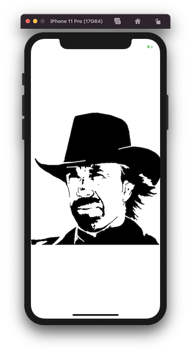
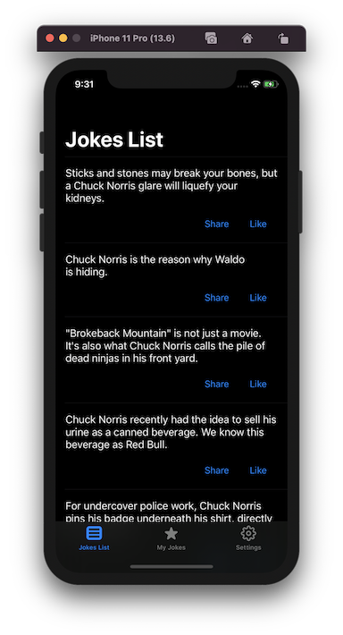
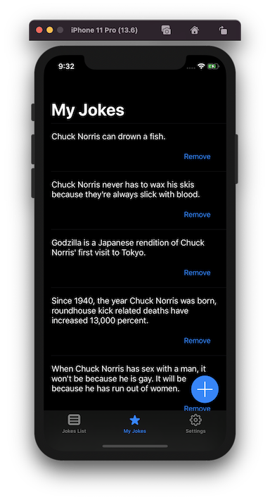
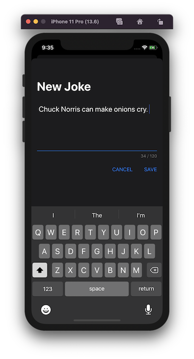
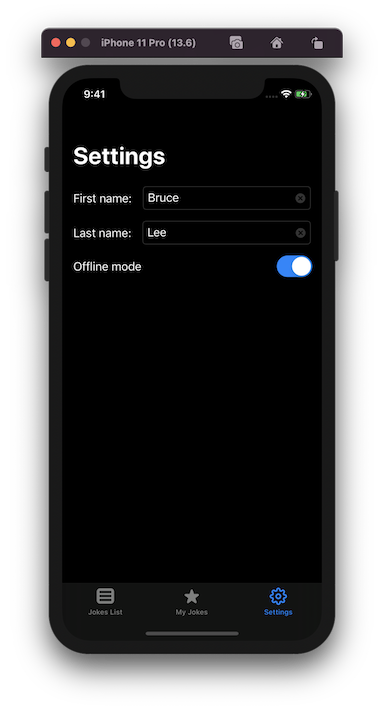
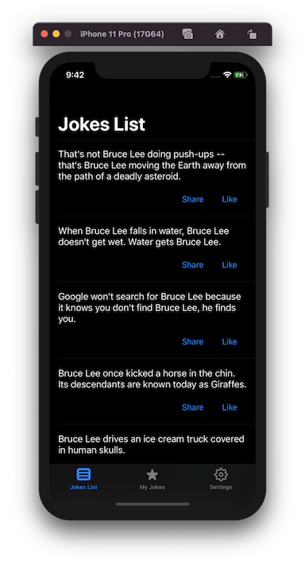

# Jokes

The `Jokes` is a simple client-server application with a minimalistic design, created to demonstrate iOS development skills. The app's architecture is based on the `SOLID` principles and the `Clean architecture` philosophy. 

### Screenshots
 

## Original task

Write a small application using the API of ​http://www.icndb.com​.  
  The app consists of 3 screens:
* Jokes List
* My Jokes
* Settings

### Jokes List

Presents a continuous list of jokes provided by API
* The user can share a joke with friends using `UIActivity`
* The user can press Like button after which joke is added to `My Jokes`
* The user can shake device on this screen and refresh list

### My Jokes

Presents a list of jokes user liked or added manually
* List user jokes
* The user can delete jokes
* The user can add new jokes and typing in dialog with a text field

### Settings

Allows the user to change the main character name and put an app to fully offline mode
* Offline mode disables API communication and by shaking the device on `Jokes List`​ it should show random one joke that we have in local storage
* Character firstname and lastname should replace all appearances of  `Chuck Norris` name

### Notes
* Application should work on `iOS 11.0+`
* Bonus points for covering business logic with tests
* Bonus points for using `RxSwift`
* Bonus points for implementing persistent caching solution (that will persist across app restart)
